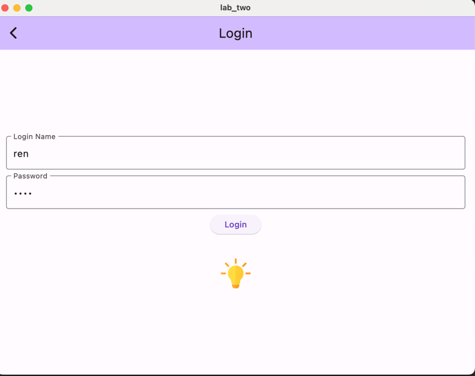
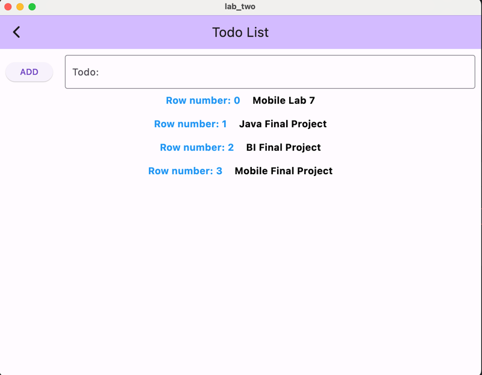

# Lab 7 - Using Database with Flutter

**Student Name:** Xihai Ren  
**Student No:** 041127486  
**Professor:** Eric Torunski  
**Due Date:** 2024/07/12

## Description
This project demonstrates the use of a SQLite database in a Flutter application using the Floor package. The application allows users to manage a list of Todo items with the ability to add, view, and delete items. The data is securely stored using encrypted shared preferences.

## Project Structure
- **lib/**
  - `main.dart` - The entry point of the application.
  - `Todo.dart` - The Todo entity class.
  - `TodoDAO.dart` - The Data Access Object (DAO) for the Todo entity.
  - `DatabaseOperator.dart` - Utility class for database operations.
  - `ProfilePage.dart` - The profile screen.
  - `TodoListPage.dart` - The todo list screen.
  - `ConfigProperties.dart` - Configuration properties for the application.
  - `DataRepository.dart` - Manages user data storage and retrieval.
  - `database.dart` - Database setup and configuration.

## Database Implementation

### Todo Entity
The `Todo` class represents a todo item entity in the database.

```dart
/*
 * Student Name: Xihai Ren
 * Student No: 041127486
 * Professor: Eric Torunski
 * Due Date: 2024/07/12
 * Description: Lab 7 - Todo entity class for use with the Floor database
 */

import 'package:floor/floor.dart';

/**
 * The Todo class represents a todo item entity in the database.
 *
 * @version 1.0.0
 * @since Dart 2.12
 * 
 * @author Xihai Ren
 */
@entity
class Todo {

  // Primary key for the todo item
  @primaryKey
  final int id;

  // Content of the todo item
  final String content;

  /**
   * Constructs a new Todo instance.
   *
   * @param id The unique identifier for the todo item.
   * @param content The content of the todo item.
   */
  Todo(this.id, this.content);
}
```

### TodoDAO
The `TodoDAO` class provides the methods that the rest of the application uses to interact with the data in the Todo table.

```dart
/*
 * Student Name: Xihai Ren
 * Student No: 041127486
 * Professor: Eric Torunski
 * Due Date: 2024/07/12
 * Description: Lab 7 - Data Access Object (DAO) for the Todo entity using Floor
 */

import 'package:floor/floor.dart';
import 'package:lab_two/Todo.dart';

/**
 * The TodoDAO class provides the methods that the rest of the application
 * uses to interact with the data in the Todo table.
 *
 * @version 1.0.0
 * @since Dart 2.12
 * 
 * @author Xihai Ren
 */
@dao
abstract class TodoDAO {
  /**
   * Retrieves all todo items from the database.
   *
   * @return A Future that resolves to a list of all todo items.
   */
  @Query('SELECT * FROM Todo')
  Future<List<Todo>> findAllTodos();

  /**
   * Finds a todo item by its id.
   *
   * @param id The id of the todo item to retrieve.
   * @return A Stream that emits the todo item with the specified id, or null if not found.
   */
  @Query('SELECT * FROM Todo WHERE id = :id')
  Stream<Todo?> findTodoById(int id);

  /**
   * Inserts a new todo item into the database.
   *
   * @param todo The todo item to insert.
   */
  @insert
  Future<void> insertTodo(Todo todo);

  /**
   * Deletes a todo item by its id.
   *
   * @param id The id of the todo item to delete.
   */
  @Query('DELETE FROM Todo WHERE id = :id')
  Future<void> deleteTodoById(int id);
}
```

### Database Configuration
The `AppDatabase` class is the main database configuration class that uses the Floor package to set up the database and manage entities.

```dart
/*
 * Student Name: Xihai Ren
 * Student No: 041127486
 * Professor: Eric Torunski
 * Due Date: 2024/07/12
 * Description: Lab 7 - Database configuration using Floor
 */

// Required package imports
import 'dart:async';
import 'package:floor/floor.dart';
import 'package:sqflite/sqflite.dart' as sqflite;

import 'package:lab_two/TodoDAO.dart';
import 'package:lab_two/Todo.dart';
part 'database.g.dart'; // the generated code will be there

/**
 * The AppDatabase class is the main database configuration class
 * that uses the Floor package to set up the database and manage entities.
 *
 * @version 1.0.0
 * @since Dart 2.12
 * 
 * @author Xihai Ren
 */
@Database(version: 1, entities: [Todo])
abstract class AppDatabase extends FloorDatabase {
  /**
   * Provides the TodoDAO instance for accessing Todo entities in the database.
   *
   * @return TodoDAO The data access object for Todo entities.
   */
  TodoDAO get todoDAO;
}
```

### Database Operator
The `DatabaseOperator` class handles database operations such as initializing the database and accessing data access objects (DAOs).

```dart
/*
 * Student Name: Xihai Ren
 * Student No: 041127486
 * Professor: Eric Torunski
 * Due Date: 2024/07/12
 * Description: Lab 7 - Using database
 */

import 'Todo.dart';
import 'TodoDAO.dart';
import 'database.dart';

/**
 * The DatabaseOperator class handles database operations
 * such as initializing the database and accessing data access objects (DAOs).
 *
 * @version 1.0.0
 * @since Dart 2.12
 *
 * @author Xihai Ren
 */
class DatabaseOperator {
  // Static variable to hold the database instance
  static late final AppDatabase? _database;

  /**
   * Initializes the database if it has not been initialized.
   * Uses the Floor library to build the database.
   *
   * @return Future<void> A Future that completes when the database is initialized.
   */
  static Future<void> initDatabase() async {
    _database =
        await $FloorAppDatabase.databaseBuilder('app_database.db').build();
  }

  /**
   * Gets the TodoDAO instance. If the database has not been initialized, it will initialize it first.
   *
   * @return Future<TodoDAO?> A Future that completes with the TodoDAO instance.
   */
  static Future<TodoDAO?> getTodoDAO() async {
    if (_database == null) {
      await initDatabase();
    }
    return _database?.todoDAO;
  }

  /**
   * Gets all Todo items from the database.
   * Ensures that the database is initialized and the TodoDAO is available.
   *
   * @return Future<List<Todo>> A Future that completes with a list of all Todo items.
   */
  static Future<List<Todo>> getAllToItems() async {
    List<Todo> list = [];
    TodoDAO? todoDAO = await getTodoDAO();
    if (todoDAO != null) {
      list = await todoDAO.findAllTodos();
    }
    return list;
  }
}
```

## Screenshots
### Main Screen


### Todo List Screen


## Running the Application
1. **Setup the environment:**
  - Ensure you have Flutter installed.
  - Run `flutter pub get` to get the dependencies.

2. **Run the application:**
  - Execute `flutter run` in the terminal to launch the application.

## Conclusion
This project demonstrates how to integrate SQLite database into a Flutter application using the Floor package. It covers creating entity classes, DAOs, and a database configuration class. The project also includes secure data storage using encrypted shared preferences.
