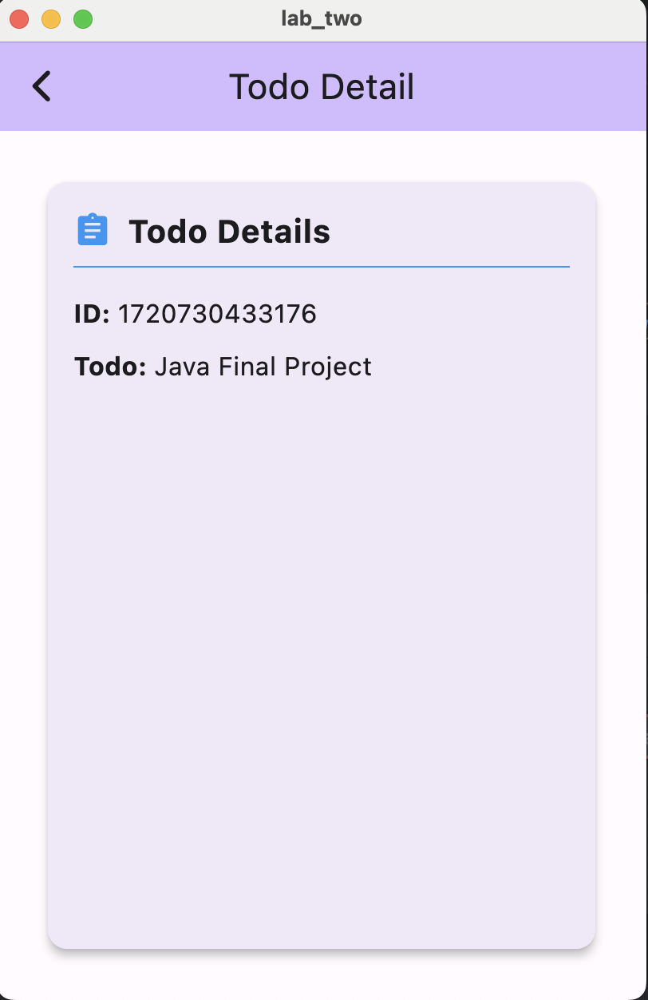

# Todo List Application

This Flutter application allows users to manage a list of todo items. Users can add new items, view the details of each item, and delete items. The application features a responsive layout that adapts to different screen sizes.

## Features

- Add new todo items
- View details of selected todo items
- Delete todo items
- Responsive layout for different screen sizes

## Screenshots

